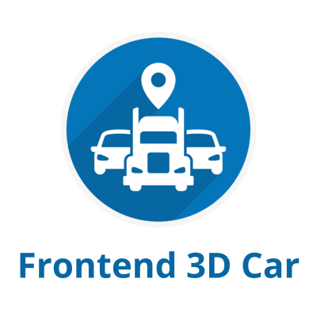

<p align="center">
  <a rel="noopener" target="_blank"></a>
</p>

**Fronend 3D Car** is an app that allows users to select a pre-determined route and view it on a map, with it's starting and ending point, while a vehicle travels along the route. It is also possible to change the app language from portuguese to english.

<div align="center">


</div>

## **Installation**

### First run the command git clone

<br>

**HTTPS:**

```sh
$ git clone https://github.com/eduardovrs/frontend3dcar.git
```

**SSH:**

```sh
$ git clone git@github.com:eduardovrs/frontend3dcar.git
```

**Go to the folder and run the command yarn to install all the dependencies**

```sh
$ cd frontend3dcar && yarn
```

## **Builds**

To run the project you can run the following command:

```sh
$ yarn start
```

### **Android**

```sh
$ yarn android
```

# **Technologies**

[TypeScript](https://www.typescriptlang.org/docs/)

[NativeWind](https://www.nativewind.dev/)

[React Native Config](https://github.com/lugg/react-native-config)

[React Native Maps](https://github.com/react-native-maps/react-native-maps)

[React Native Navigation](https://reactnavigation.org/docs/getting-started/)

[i18next](https://www.i18next.com/)

[React-i18next](https://github.com/i18next/react-i18next)

# Author

- [Eduardo Vinícius](https://github.com/eduardovrs) (edu.vinirodrigues@gmail.com)
